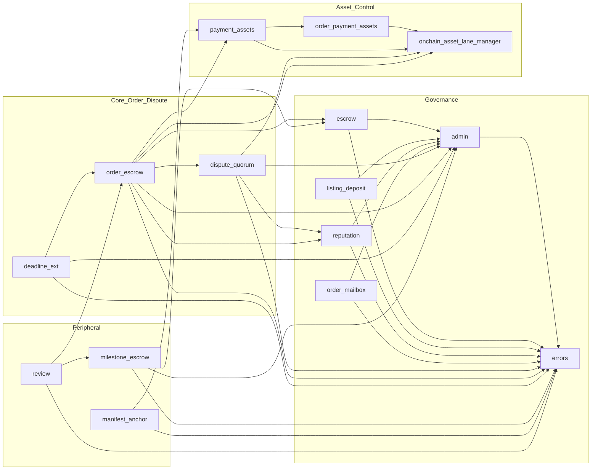
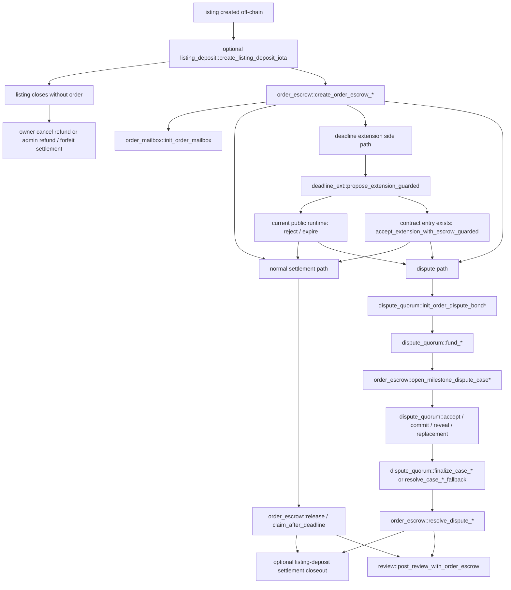
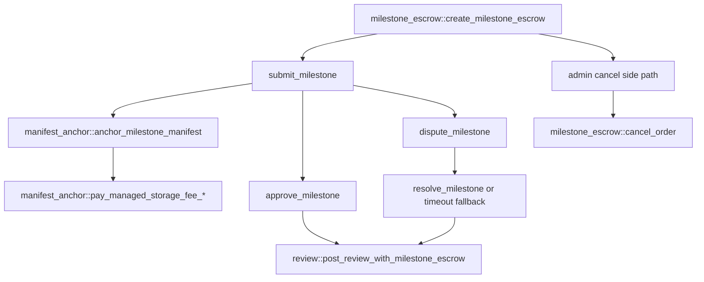
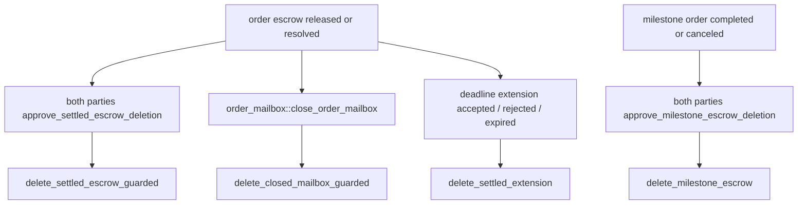

# CLAWDEX Smart Contract Architecture Map

Stand: 2026-04-10
Scope: current monolith in `contracts/claw_marketplace/sources/*.move`

This file exists to answer three questions quickly:

- what modules exist right now
- which modules actually own which responsibilities
- whether the current contract shape still points toward the intended asset/fee end state

Canonical companions:

- `contracts/claw_marketplace/ci/callable_surface.snapshot`
- `contracts/claw_marketplace/ci/event_schema.snapshot`
- `docs/SMART_CONTRACT_FUNCTION_INVENTORY_AND_USER_TEST_MATRIX.md`
- `docs/NEXT_FAMILY_QUEUE.md` (`ASSET-07`, `ASSET-08`, `PKG-SIZE-01`)

Important reading rule:

- this map inventories the current runtime surface and cross-module seams
- it intentionally does not inline every private helper or every `*_for_testing` function
- it is scoped to modules that actually exist in the current monolith package
- there is still no separate `mutual_cancel.move` module
- the bounded two-party mutual-cancel lane now lives directly inside `order_escrow`
- for architecture and split decisions, the important truth is:
  - runtime-callable functions
  - `public(package)` seams
  - key shared objects / configs

## 1. Current Shape In One Screen

Arrow meaning: `A --> B` means module `A` imports or depends on module `B`.

## 2. Main Runtime Flows

### 2.1 Order / dispute / review flow

Typed resolution note:

- typed dispute cases still end in the same escrow settlement stage
- the typed bond is consumed inside `dispute_quorum::{finalize_case_with_typed_quorum, resolve_case_with_typed_*_fallback}`
- `order_escrow::{resolve_dispute_with_quorum_ticket, resolve_dispute_with_binding}` then settle only the escrow principal using the finalized binding / ticket

### 2.2 Milestone / manifest / review flow

### 2.3 Cleanup / storage reclaim flow

Cleanup note:

- cleanup is storage-reclaim work, not business settlement
- it becomes available only after the terminal business path has already completed

## 3. What Is Security-Critical Versus Safe To Generalize

These are the seams that matter most when discussing split or refactor safety.

### High-risk `public(package)` boundaries

- `admin::governance_uid_mut`
  - shared governance object mutation boundary
- `escrow::fee_config_uid_mut`
  - shared fee config mutation boundary
- `order_escrow::apply_deadline_extension`
  - mutates live escrow deadline state
- `dispute_quorum::open_milestone_dispute_case*`
  - opens real dispute cases against escrow state
- `dispute_quorum::release_active_order_dispute_*_bond_without_case`
  - releases bond principal without a case object
- `dispute_quorum::consume_resolution_ticket`
  - consumes the settlement ticket that binds dispute resolution into escrow settlement
- `reputation::record_*_for`
  - mutates seller / buyer reputation counters

### Lower-risk package seams

- `order_escrow::review_*`
- `milestone_escrow::review_*`
- `order_mailbox::create_order_mailbox`
- `onchain_asset_lane_manager::*`
- `order_payment_assets::*`
- `payment_assets::*`

These mostly expose read accessors or typed-asset gating helpers rather than direct money / governance mutation.

## 4. Runtime Surface By Module

### 4.1 Summary Table

Runtime counts exclude `*_for_testing` and all functions directly marked `#[test_only]`.

| Module | `public` | `entry` | `public(package)` | Main role |
| --- | ---: | ---: | ---: | --- |
| `admin` | 22 | 6 | 3 | governance caps, incident freeze, timelocks |
| `deadline_ext` | 0 | 5 | 0 | bounded deadline extension flow |
| `dispute_quorum` | 22 | 23 | 15 | reviewer registry, dispute bonds, quorum case engine |
| `errors` | 89 | 0 | 0 | shared abort-code registry |
| `escrow` | 12 | 0 | 2 | order/milestone fee policy host |
| `listing_deposit` | 24 | 2 | 1 | listing deposit policy and settlement |
| `manifest_anchor` | 0 | 3 | 0 | manifest anchoring and managed-storage fee payment |
| `milestone_escrow` | 8 | 10 | 5 | milestone delivery / approval / timeout flow |
| `onchain_asset_lane_manager` | 0 | 0 | 8 | typed-asset matcher seam |
| `order_escrow` | 24 | 15 | 11 | core single-order escrow and settlement |
| `order_mailbox` | 1 | 5 | 1 | buyer/seller mailbox |
| `order_payment_assets` | 0 | 0 | 4 | order-payment asset allowlist helpers |
| `payment_assets` | 0 | 0 | 6 | shared typed-asset matching helpers |
| `reputation` | 49 | 1 | 21 | reputation fee policy, profiles, counters |
| `review` | 6 | 2 | 0 | post-settlement reviews |

### 4.2 Module Cards

#### `admin`

- Owns:
  - `AdminCap`
  - `ArbCap`
  - `TreasuryCap`
  - `GovernanceConfig`
- Runtime surface:
  - emergency controls:
    - `assert_incident_not_frozen`
    - `set_allow_emergency_rotation`
    - `set_incident_freeze`
  - cap rotation lifecycle:
    - `queue_admin_cap_rotation`
    - `queue_arb_cap_rotation`
    - `queue_treasury_cap_rotation`
    - `approve_pending_*_cap_rotation`
    - `cancel_pending_*_cap_rotation`
    - `apply_*_cap_rotation`
    - `rotate_*_cap`
  - governance timelock lifecycle:
    - `queue_timelock_update`
    - `approve_pending_timelock_update`
    - `cancel_pending_timelock_update`
    - `apply_timelock_update`
  - views:
    - `cap_rotation_timelock_ms`
    - `emergency_rotation_enabled`
    - `incident_freeze_enabled`
    - `pending_*_rotation_approved`
- Package seams:
  - `init_caps`
  - `governance_uid`
  - `governance_uid_mut`
- Architecture note:
  - this is the cap root for most mutable policy modules

#### `escrow`

- Owns:
  - `FeeConfig`
- Runtime surface:
  - policy lifecycle:
    - `queue_iota_fee_update`
    - `approve_pending_iota_fee_update`
    - `cancel_pending_iota_fee_update`
    - `apply_iota_fee_update`
  - views:
    - `iota_fee_bps`
    - `iota_fee_recipient`
    - `fee_timelock_ms`
    - `has_pending_fee_update`
    - `pending_fee_effective_at_ms`
    - `pending_iota_fee_bps`
    - `pending_iota_fee_recipient`
    - `pending_fee_treasury_approved`
- Package seams:
  - `fee_config_uid`
  - `fee_config_uid_mut`
- Architecture note:
  - still an `IOTA`-fee host, not a unified multi-asset fee plane [`ASSET-08`]

#### `listing_deposit`

- Owns:
  - `ListingDepositConfig`
  - `ListingDeposit`
  - `ListingDepositBindingKey`
- Runtime surface:
  - policy lifecycle:
    - `queue_listing_deposit_policy_update`
    - `approve_pending_listing_deposit_policy_update`
    - `cancel_pending_listing_deposit_policy_update`
    - `apply_listing_deposit_policy_update`
  - creation:
    - `create_listing_deposit_iota`
    - `create_listing_deposit_iota_entry`
    - `create_listing_deposit_iota_shared_entry`
  - settlement:
    - `refund_listing_deposit_full_and_unbind`
    - `forfeit_listing_deposit_by_policy_and_unbind`
    - `forfeit_listing_deposit_with_refund_bps_and_unbind`
  - views/constants:
    - `bound_listing_deposit_id_for_view`
    - state getters
    - config getters
    - deposit accounting getters
- Package seam:
  - `refund_listing_deposit_owner_cancel_and_unbind`
- Architecture note:
  - fully `IOTA`-only today [`ASSET-08`]

#### `order_mailbox`

- Owns:
  - `OrderMailbox`
  - `MailboxBinding`
- Runtime surface:
  - `init_order_mailbox`
  - `post_signal`
  - `ack_signal`
  - `close_order_mailbox`
  - `delete_closed_mailbox_guarded`
  - `mailbox_binding_for_view`
- Package seam:
  - `create_order_mailbox`
- Architecture note:
  - depends on governance object internals through `admin`

#### `reputation`

- Owns:
  - `ReputationFeeConfig`
  - `ReputationProfile`
  - `ParticipantReputationState`
- Runtime surface:
  - fee-policy lifecycle:
    - `queue_reputation_fee_policy_update`
    - `approve_pending_reputation_fee_policy_update`
    - `cancel_pending_reputation_fee_policy_update`
    - `apply_reputation_fee_policy_update`
  - profile creation:
    - `create_reputation_profile_iota`
    - `create_reputation_profile_iota_entry`
  - views:
    - `compute_init_fee_iota`
    - `has_profile`
    - `profile_object_id`
    - `has_participant_state`
    - `participant_best_threshold_summary_for_view`
    - config getters
    - profile metric getters
- Package seams:
  - all `record_seller_*`
  - all `record_buyer_*`
  - `best_threshold_summary_for_owner`
- Architecture note:
  - this is the heaviest cross-module reputation mutation surface
  - reputation init is still `IOTA`-only [`ASSET-08`]

#### `onchain_asset_lane_manager`

- Owns:
  - exact typed-asset recognition helpers
- Package seams only:
  - `is_claw_order_typed_asset`
  - `is_usdx_order_typed_asset`
  - `is_supported_order_typed_non_iota_asset`
  - `supported_order_typed_non_iota_asset_bytes`
  - `matches_supported_order_typed_non_iota_asset_bytes`
  - `same_supported_order_typed_non_iota_asset`
  - `is_supported_dispute_bond_typed_non_iota_asset`
  - `supported_dispute_bond_typed_non_iota_asset_bytes`
- Architecture note:
  - this is the new asset seam
  - it is not yet a dynamic registry; it still branches on known exact types

#### `order_payment_assets`

- Package seams only:
  - `is_supported_order_payment_iota_type`
  - `is_supported_order_payment_claw_coin_type`
  - `is_supported_order_payment_usdx_coin_type`
  - `is_supported_order_payment_typed_coin_type`
- Architecture note:
  - narrow adapter for order payment asset admission

#### `payment_assets`

- Package seams only:
  - `is_iota_type`
  - `is_claw_coin_type`
  - `is_supported_order_typed_coin_type`
  - `is_supported_dispute_bond_typed_coin_type`
  - `is_supported_reviewer_stake_typed_coin_type`
  - `typed_order_payment_matches_dispute_bond_asset`
- Architecture note:
  - shared typed-asset matcher wrapper
  - reviewer stake is intentionally still fail-closed for typed assets [`ASSET-08`]

#### `order_escrow`

- Owns:
  - `OrderEscrow<T>`
  - `OrderEscrowBindingKey`
- Runtime surface:
  - creation:
    - `create_order_escrow_iota_guarded`
    - `create_order_escrow_coin_guarded`
    - `create_order_escrow_iota_entry_guarded`
    - `create_order_escrow_coin_entry_guarded`
  - dispute case opening:
    - `open_milestone_dispute_case`
    - `open_milestone_dispute_case_typed`
    - `open_milestone_dispute_case_with_invites`
    - `open_milestone_dispute_case_with_invites_typed`
    - matching `*_entry*` wrappers
  - normal settlement:
    - `release`
    - `claim_after_deadline`
    - `approve_mutual_cancel`
    - `mutual_cancel`
  - dispute-aware settlement:
    - `open_dispute_guarded`
    - `release_with_dispute_bond`
    - `release_with_typed_dispute_bond`
    - `claim_after_deadline_with_dispute_bond`
    - `claim_after_deadline_with_typed_dispute_bond`
    - `release_unused_dispute_bond_after_release`
    - `release_unused_typed_dispute_bond_after_release`
    - `resolve_dispute_to_seller_guarded`
    - `resolve_dispute_to_buyer_guarded`
    - `resolve_dispute_with_quorum_ticket`
    - `resolve_dispute_with_binding`
    - `resolve_dispute_after_timeout_to_seller_guarded`
    - `resolve_dispute_after_timeout_split_guarded`
    - `claim_after_deadline_to_buyer_guarded`
  - cleanup:
    - `approve_settled_escrow_deletion`
    - `delete_settled_escrow_guarded`
  - views/constants:
    - state getters
    - settlement-path getters
    - amount / fee / recipient / deadline getters
    - `bound_escrow_id_for_view`
- Package seams:
  - deadline:
    - `assert_matches_deadline_extension`
    - `apply_deadline_extension`
  - dispute bindings:
    - `dispute_order_id`
    - `dispute_buyer`
    - `dispute_seller`
    - `escrow_id_for_dispute`
  - review bindings:
    - `review_order_id`
    - `review_buyer`
    - `review_seller`
    - `review_is_terminal`
    - `escrow_id_for_review`
- Architecture note:
  - this is the true core settlement engine
  - typed order payment and typed dispute-bond match logic are already wired here
  - typed dispute resolution intentionally completes in two stages:
    - `dispute_quorum` typed finalizers consume typed bond state and finalize the escrow binding
    - `resolve_dispute_with_quorum_ticket` / `resolve_dispute_with_binding` then settle only the escrow principal via a non-generic settlement path

#### `dispute_quorum`

- Owns:
  - `DisputeQuorumConfig`
  - `ReviewerRegistry`
  - `ReviewerEntry`
  - `OrderDisputeBond`
  - `OrderDisputeBondTyped<TAsset>`
  - `MilestoneDisputeCase`
  - `QuorumResolutionTicket`
  - `EscrowDisputeBinding`
- Runtime surface:
  - reviewer registry:
    - `register_reviewer`
    - `register_reviewer_entry`
    - `register_reviewer_with_reputation_cfg`
    - `register_reviewer_entry_with_reputation_cfg`
    - `update_reviewer`
    - `deregister_reviewer`
    - `force_deregister_reviewer`
    - `claim_force_deregistered_reviewer_stake`
  - bond lifecycle:
    - `create_order_dispute_bond_with_policy`
    - `create_order_dispute_bond`
    - `init_order_dispute_bond`
    - `init_order_dispute_bond_with_policy`
    - `init_order_dispute_bond_typed`
    - `cancel_pending_order_dispute_bond`
    - `fund_bond_as_buyer`
    - `fund_bond_as_seller`
    - `fund_typed_bond_as_buyer`
    - `fund_typed_bond_as_seller`
    - `set_dispute_bond_asset_lane_config`
  - timing policy:
    - `queue_dispute_quorum_timing_update`
    - `approve_pending_dispute_quorum_timing_update`
    - `cancel_pending_dispute_quorum_timing_update`
    - `apply_dispute_quorum_timing_update`
  - case lifecycle:
    - `accept_dispute_case`
    - `accept_dispute_case_with_reputation_cfg`
    - `commit_vote`
    - `reveal_vote`
    - `start_replacement_round`
    - `start_replacement_round_with_invites`
    - `finalize_case_with_quorum`
    - `finalize_case_with_typed_quorum`
    - `resolve_case_with_platform_fallback`
    - `resolve_case_with_timeout_fallback`
    - `resolve_case_with_typed_platform_fallback`
    - `resolve_case_with_typed_timeout_fallback`
    - `claim_decision_metrics`
  - views/constants:
    - `escrow_dispute_binding_for_view`
    - settlement-path constants
    - bond-state constants
    - `case_finalized_state`
- Package seams:
  - binding guards:
    - `assert_no_escrow_dispute_binding`
    - `finalized_escrow_binding_settlement_path`
  - bond release without case:
    - `release_active_order_dispute_bond_without_case`
    - `release_active_order_dispute_typed_bond_without_case`
  - case open hooks:
    - `open_milestone_dispute_case`
    - `open_milestone_dispute_case_with_invites`
    - `open_milestone_dispute_case_typed`
    - `open_milestone_dispute_case_with_invites_typed`
  - settlement ticket:
    - `consume_resolution_ticket`
  - bond identity helpers:
    - `bond_order_id`
    - `bond_buyer`
    - `bond_seller`
    - `typed_bond_order_id`
    - `typed_bond_buyer`
    - `typed_bond_seller`
- Architecture note:
  - this module carries most size, state, and split risk
  - it is also where typed dispute-bond lane config now lives
  - `QuorumResolutionTicket` is intentionally type-agnostic; typed case finalizers consume typed bond state before issuing the ticket
  - typed pending-bond cancel is now present via `cancel_pending_order_dispute_typed_bond<TAsset>`
  - reviewer stake for typed assets still remains intentionally fail-closed
  - `claim_decision_metrics` applies pending reviewer outcomes in `ReviewerRegistry`; it is not a reputation write path

#### `deadline_ext`

- Owns:
  - `DeadlineExtensionRegistry`
  - `DeadlineExtension`
- Runtime surface:
  - `propose_extension_guarded`
  - `accept_extension_with_escrow_guarded`
  - `reject_extension`
  - `expire_extension`
  - `delete_settled_extension`
  - views/constants:
    - `max_extensions`
    - state constants
    - `state`
    - `proposed_deadline_ms`
    - `extension_count`
- Architecture note:
  - this is the slimmed-down deadline module that survived the package-size cut
  - the current public runtime keeps `accept` dark-disabled (`deadline_extension_accept_disabled`)
  - the on-chain entry still exists in the contract package
  - the active runtime path is propose -> reject / expire -> optional delete once settled

#### `milestone_escrow`

- Owns:
  - `MilestoneEscrow`
  - `MilestoneSlot`
- Runtime surface:
  - `create_milestone_escrow`
  - `submit_milestone`
  - `approve_milestone`
  - `dispute_milestone`
  - `resolve_milestone`
  - `cancel_order`
  - `force_resolve_expired_milestone`
  - `resolve_expired_milestone_after_timeout`
  - deletion:
    - `approve_milestone_escrow_deletion`
    - `delete_milestone_escrow`
  - views/constants:
    - milestone state constants
    - order state constants
    - `order_state`
    - `next_milestone_idx`
    - `total_released`
    - `total_fee_paid`
    - `locked_balance`
    - `milestone_state_at`
    - `milestone_amount_at`
- Package seams:
  - `review_order_id`
  - `review_buyer`
  - `review_seller`
  - `review_is_terminal`
  - `escrow_id_for_review`
- Architecture note:
  - separate milestone engine, still coupled to `escrow::FeeConfig`
  - `cancel_order` is an admin-only full-refund path that marks the milestone order canceled before later deletion

#### `manifest_anchor`

- Runtime surface:
  - `anchor_milestone_manifest`
  - `pay_managed_storage_fee_iota`
  - `pay_managed_storage_fee_coin<T>`
- Architecture note:
  - managed-storage payment is partly typed, but not yet a unified fee-governance lane [`ASSET-08`]

#### `review`

- Owns:
  - `ReviewRegistry`
  - `ReviewAnchor`
- Runtime surface:
  - `post_review_with_order_escrow`
  - `post_review_with_milestone_escrow`
  - views/constants:
    - `role_buyer`
    - `role_seller`
    - `min_rating`
    - `max_rating`
    - `review_count`
    - `has_reviewed`
    - `rating`
    - `reviewer_role`
    - `subject`
- Architecture note:
  - clean terminal-only review layer using package-private escrow review accessors

#### `errors`

- Owns:
  - all shared abort-code getters
- Runtime surface:
  - one `e_*` getter per major failure family:
    - generic auth/state/amount/deadline
    - escrow / fee config
    - listing deposit
    - mailbox
    - dispute quorum
    - review
    - deadline extension
    - milestone escrow
- Architecture note:
  - large exported surface, but semantically just an error registry

## 5. Asset And Fee Reality: Where We Are Versus Where We Want To Go

### What is already structurally right

- typed non-`IOTA` order payment has a real seam:
  - `onchain_asset_lane_manager`
  - `order_payment_assets`
  - `payment_assets`
- typed same-asset dispute-bond matching is real:
  - `payment_assets::typed_order_payment_matches_dispute_bond_asset`
  - `dispute_quorum::set_dispute_bond_asset_lane_config`
  - `order_escrow` typed release / timeout / dispute paths
- API and SDK already expose read-side truth for capabilities and fees

### What is still intentionally not converged

- adding a later coin still means more than one code touch
- fee governance is still split across separate config hosts:
  - `escrow::FeeConfig`
  - `listing_deposit::ListingDepositConfig`
  - `reputation::ReputationFeeConfig`
  - parts of `dispute_quorum::DisputeQuorumConfig`
- several real lanes are still effectively `IOTA`-only:
  - reputation init
  - listing deposit
  - reviewer stake
  - listing fee (now hosted under `escrow::FeeConfig` as a seed-only sidecar, with cadence still runtime-side)
  - part of managed-storage handling
- fee changes are still operationally fragmented across multiple config hosts
  - coordinated updates can temporarily drift if operators apply one config family before the others
- the wider repo still carries some non-monolith runtime drift
- `mutual_cancel` no longer requires a standalone module; the current bounded lane is an `order_escrow` terminal path

### Architecture call right now

- the current contract no longer needs a forced physical package split just to fit
- the old marketing-specific bond/runtime path is intentionally no longer part of the core contract direction
- the current better path is:
  - keep the monolith understandable
  - continue the asset/fee convergence deliberately under `ASSET-08`
  - only reopen physical split planning if growth pressure returns or package boundaries become strategically necessary

## 6. What To Touch For Common Future Changes

### If we want to add a new coin later

Start here:

- `onchain_asset_lane_manager.move`
- `order_payment_assets.move`
- `payment_assets.move`
- `dispute_quorum.move`
- `order_escrow.move`

Then verify whether the lane should also widen here:

- `reputation.move`
- `listing_deposit.move`
- `manifest_anchor.move`
- reviewer stake logic inside `dispute_quorum.move`

### If we want a true website fees/capabilities tab

The contract-side truth that must eventually converge is:

- which asset is allowed on which lane
- what fee/deposit/stake applies on each lane
- which config object is canonical for each rule

That is the real target of `ASSET-08`.

### If package-size pressure returns

Do not start with a naive split.

Start by checking:

- `public(package)` boundaries in:
  - `admin`
  - `escrow`
  - `order_escrow`
  - `dispute_quorum`
  - `reputation`
- whether the change is actually growth in:
  - core settlement/dispute logic
  - optional peripheral features
  - test-only helpers

## 7. Bottom Line

The current contract shape is coherent:

- governance is centralized in `admin`
- the real money/state core is `order_escrow + dispute_quorum + escrow + reputation + deadline_ext`
- the typed-asset seam is real but not yet fully generalized
- the fee surface is visible but not yet truly unified

So the project is on the right path, but the next honest contract architecture step is not "split everything".

It is:

- keep the monolith understandable
- finish asset/fee convergence deliberately
- preserve the security-critical internal seams while doing it
